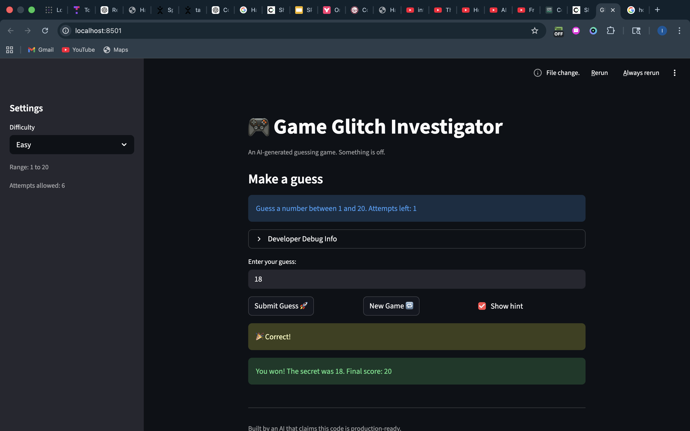

# 🎮 Game Glitch Investigator: The Impossible Guesser

## 🚨 The Situation

You asked an AI to build a simple "Number Guessing Game" using Streamlit.
It wrote the code, ran away, and now the game is unplayable. 

- You can't win.
- The hints lie to you.
- The secret number seems to have commitment issues.

## 🛠️ Setup

1. Install dependencies: `pip install -r requirements.txt`
2. Run the broken app: `python -m streamlit run app.py`

## 🕵️‍♂️ Your Mission

1. **Play the game.** Open the "Developer Debug Info" tab in the app to see the secret number. Try to win.
2. **Find the State Bug.** Why does the secret number change every time you click "Submit"? Ask ChatGPT: *"How do I keep a variable from resetting in Streamlit when I click a button?"*
3. **Fix the Logic.** The hints ("Higher/Lower") are wrong. Fix them.
4. **Refactor & Test.** - Move the logic into `logic_utils.py`.
   - Run `pytest` in your terminal.
   - Keep fixing until all tests pass!

## 📝 Document Your Experience

- [ ] Describe the game's purpose.
   It's a guessing game, where you try to guess a pre-determined number(secret) from na range of numbers.

- [ ] Detail which bugs you found.

   - I noticed the game kept telling me to guess higher when the correct guess was actually lower, and vice-versa
   - I also noticed the range of numbers to guess from were not correctly assigned to the difficulty ranges (eg. 1-100 for Normal but 1-50 for Hard).
   - I also noticed the numbers of attempts were not correctly assigned to the difficulty ranges (eg. 5 attempts for easy but 7 attempts for Normal).
   - I also noticed I couldn't restart the game after I had clicked on the new game button twice

- [ ] Explain what fixes you applied.

   -  I fixed the numerical comparison between the numbers, because they were being compared as strings instead of integers.
   -  The game was hardcoded to include numbers from 1-100 no matter the difficulty, so I included an conditional statement for the number ranges of each diffculty to reflect on the actual game when the diffciulties are changed.
   -  The same issue as the above occured, but in this case the allowed attempts for each difficutly were not reflected, so I added a conditional statement to fix that.
   - The New Game button wasn't resetting the game, and that was because the status of each new game was never set to 0, so I added that line of code.

## 📸 Demo

- [ ] [Insert a screenshot of your fixed, winning game here]

## 🚀 Stretch Features

- [ ] [If you choose to complete Challenge 4, insert a screenshot of your Enhanced Game UI here]
